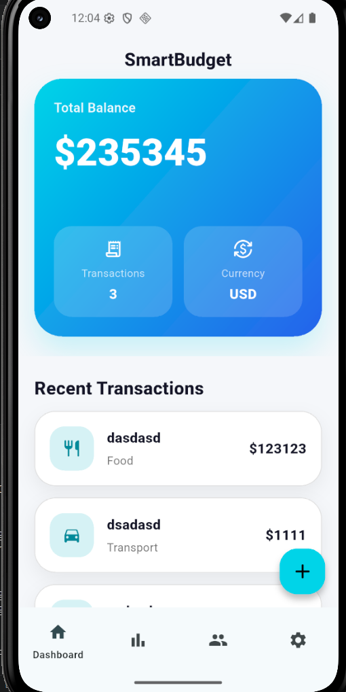
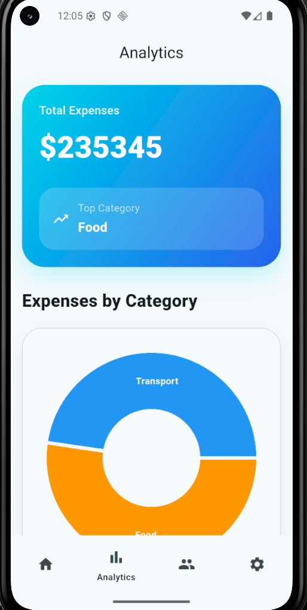
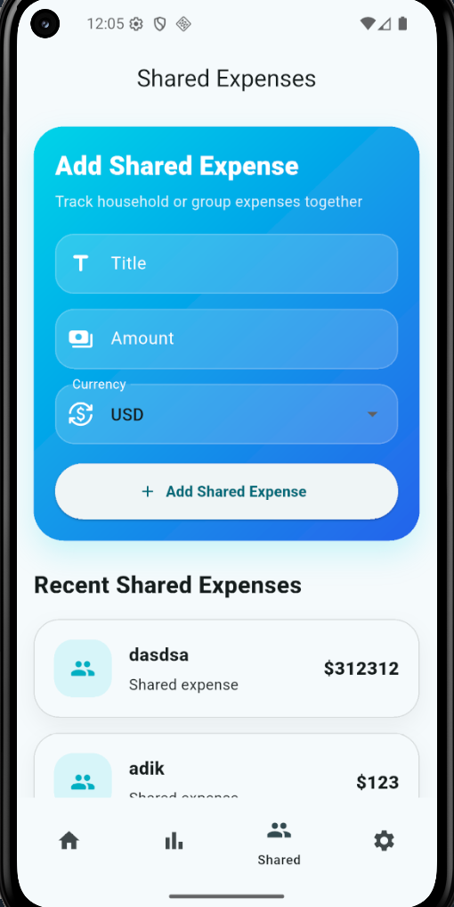
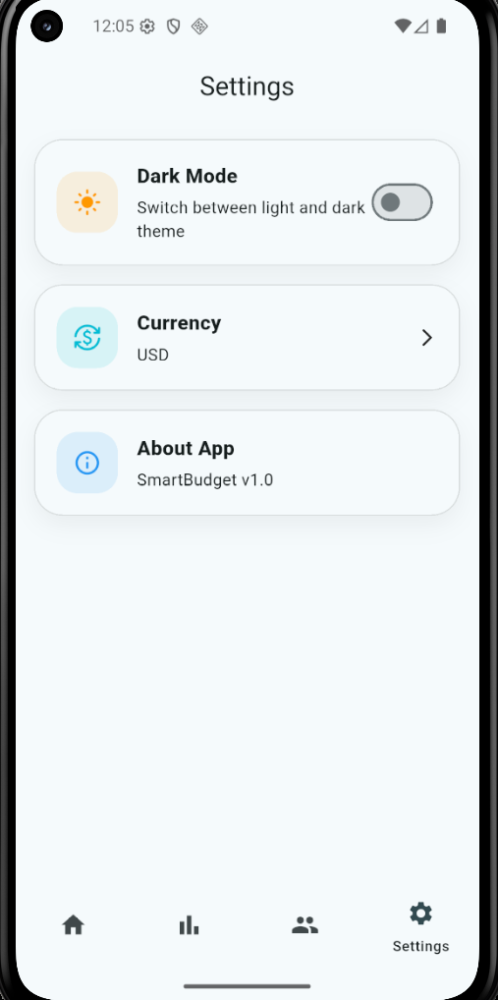

# SmartBudget

SmartBudget is a Flutter-based personal finance tracking application developed as a final project.

The application helps users manage personal and shared expenses, visualize spending analytics, and customize their budgeting experience with real-time currency conversion and cloud synchronization.

---

# Features

## Personal Expense Tracking

- Add and delete transactions
- Categorize expenses
- Local persistence using Drift (SQLite)

## Shared Expenses

- Shared household/group expenses
- Cloud synchronization using Firebase Firestore
- Real-time updates with StreamBuilder

## Analytics

- Pie chart expense visualization
- Top spending category
- Total expenses overview
- Currency-aware analytics

## Settings

- Dark / Light mode
- Currency switching (USD / KZT)
- Persistent user preferences using SharedPreferences

## Navigation

- Declarative routing using go_router
- Nested routing and back-stack management

---

# Technologies Used

## State Management

- Riverpod

## Local Persistence

- Drift (SQLite)
- SharedPreferences

## Cloud Services

- Firebase Firestore

## Networking

- Chopper API Client

## UI

- Flutter Material 3
- SliverAppBar
- fl_chart

---

# Architecture

The project follows Clean Architecture principles by separating presentation, data, and domain responsibilities.

## Presentation Layer

- Screens
- Widgets
- Providers

## Data Layer

- API services
- Firebase services
- Drift database

## Domain Layer

- Models
- Business logic services

---

# Project Structure

```text
lib/
├── database/
│   ├── app_database.dart
│   └── app_database.g.dart
│
├── models/
│   ├── transaction_model.dart
│
├── providers/
│   ├── currency_provider.dart
│   ├── currency_rate_provider.dart
│   ├── theme_provider.dart
│   └── transaction_provider.dart
│
├── router/
│   └── app_router.dart
│
├── screens/
│   ├── dashboard_page.dart
│   ├── analytics_page.dart
│   ├── shared_expenses_page.dart
│   ├── settings_page.dart
│   ├── add_transaction_page.dart
│   └── main_navigation_page.dart
│
├── services/
│   ├── analytics_service.dart
│   ├── currency_service.dart
│   ├── currency_service.chopper.dart
│   └── transaction_service.dart
│
├── firebase_options.dart
└── main.dart
```

---

# Main Features Demonstrated

- Complex UI using Sliver widgets
- Responsive layouts
- State management with Riverpod
- Local persistence with Drift
- Cloud persistence with Firestore
- External API integration with Chopper
- Dark/Light theme support
- Declarative navigation with go_router
- Loading, error, and empty states handling

---

# Screenshots

## Dashboard



## Analytics



## Shared Expenses



## Settings



---

# Setup Instructions

## 1. Clone repository

```bash
git clone <repository-link>
```

## 2. Install dependencies

```bash
flutter pub get
```

## 3. Run the application

```bash
flutter run
```

---

# Team Members

- Aksungkar Ganiyatov
- Adilet Zhambyl
- Murat Narynbekov

---

# Demo Video

https://drive.google.com/file/d/1NpdBrrYF9OVxbL3zvbN4qZeUTvH2YxYg/view?usp=sharing

---

# Future Improvements

- Budget planning system
- Notifications and reminders
- Authentication system
- Multi-user collaboration
- Monthly financial reports

---

# License

This project was developed for educational purposes.